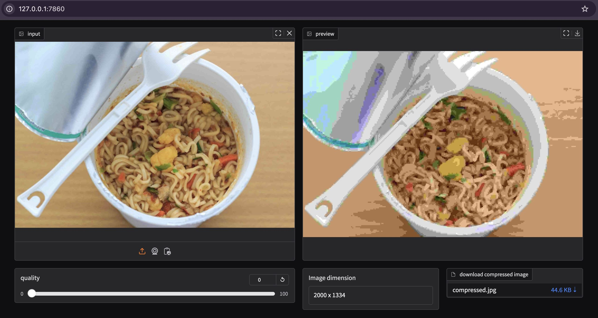

# JPEG compress with preview

with this script you can compress your images to jpeg with live preview.

## Installation & Run

create a python virtual environment and activate.
```bash
python -m venv venv
source venv/bin/activate
```
install gradio. it will automatically install pillow library as it's dependency.
```bash
pip install gradio
```
run compress_with_preview.py with
```bash
python compress_with_preview.py
```

this will launch a local gradio interface in your pc with local url http://127.0.0.1:7860. Go to your web browser and paste this url and enjoy your jpeg compression live preview.


## Screenshot




## License

[MIT](https://choosealicense.com/licenses/mit/)